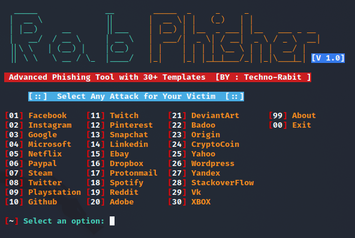
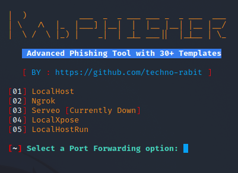

<p align="left">
<a href="#"></a>
</p>
<p align="center">
<a href="#"></a>
</p>
<p align="center">
<a href="https://github.com/techno-rabit"></a>
<a href="#"></a>
</p>
<p align="center">
<a href="#"></a>
</p>

## Installation :

* `apt update`
* `apt install git -y`
* `git clone git://github.com/techno-rabit/rabphisher.git`
* `cd rabphisher`
#### > SETUP : `bash setup`
#### > SETUP [TERMUX] : `bash tmux_setup`
#### > Run : `bash rabphisher`

## Single Command :
```
apt update ; apt install git -y ; git clone git://github.com/techno-rabit/rabphisher.git ; cd rabphisher ; bash setup ; bash rabphisher
```
<br>
<p align="center">




## Tunelling Options :
#### > Localhost (127.0.0.1)
#### > NGROK (https://ngrok.com)
#### > SERVEO (https://serveo.net)
#### > LOCALHOSTRUN (https://localhost.run)
#### > LOCALXPOSE (https://localxpose.io/)

## Find Me on :
[](https://github.com/techno-rabit)
[](https://www.instagram.com/_.v.shnu)


